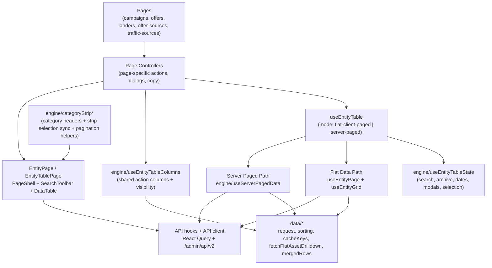

# Entity Table Architecture

This document explains how the centralized entity-table system works after the refactor.

## Goal

Unify all table-first pages under one architecture so page files stay focused on page-specific behavior (mutations, dialogs, copy), while shared table data flow and UI behavior live in one place.

Pages using this system:

- `campaigns`
- `offers`
- `landers`
- `offer-sources`
- `traffic-sources`

## High-level schema

## Runtime flow

1. Page controller calls `useEntityTable(...)` with its mode and config.
2. Shared state is managed in `useEntityTableState` (search, archive tab, date range, row selection, modal ids).
3. Data is loaded through:
   - flat mode: entity list + stats merge path (`useEntityGrid`)
   - server mode: paged table engine (`useServerPagedData`)
4. Row/column behavior is normalized through shared helpers:
   - category strip helpers (`categoryStripTable`, `categoryStripSelection`, `paginateCategorySegments`)
   - shared action columns (`useEntityTableColumns`)
5. `EntityPage` renders the shared shell (`PageShell`, `SearchToolbar`, `DataTable`), while page controllers provide custom dialogs and mutation handlers.

## Module boundaries

- `src/lib/entity-table/engine/`: reusable table orchestration logic.
- `src/lib/entity-table/data/`: request/sort/cache/merge primitives.
- `src/lib/entity-table/columns/`: shared column visibility/storage/defaults.
- `src/pages/<feature>/`: feature-specific behavior only.

## When adding a new table page

1. Create page controller under `src/pages/<feature>/`.
2. Use `useEntityTable` with:
   - `mode: 'flat-client-paged'` for list + merged stats pages
   - `mode: 'server-paged'` for paged server data
3. Use `useEntityTableColumns` unless the page has truly unique action-column behavior.
4. Keep new shared logic in `src/lib/entity-table/*`, not inside feature page files.
